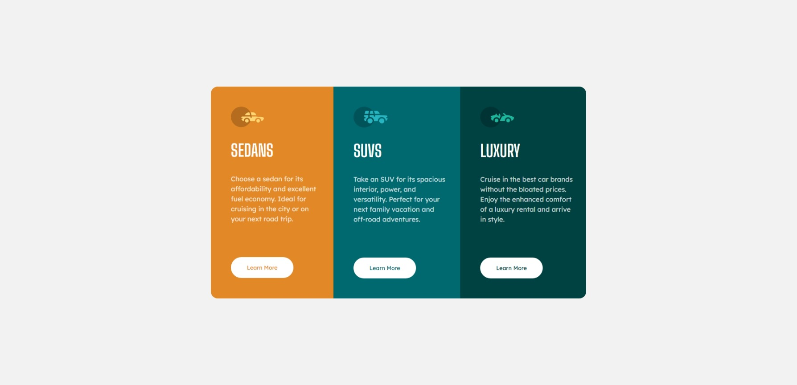

# Frontend Mentor - Column preview card solution

This is a solution to the [3-column preview card component challenge on Frontend Mentor](https://www.frontendmentor.io/challenges/3column-preview-card-component-pH92eAR2-). Frontend Mentor challenges help you improve your coding skills by building realistic projects. 

## Table of contents

- [Overview](#overview)
  - [The challenge](#the-challenge)
  - [Screenshot](#screenshot)
  - [Links](#links)
- [My process](#my-process)
  - [Built with](#built-with)
- [Author](#author)
- [Tech Stack](#%EF%B8%8F-tech-stack)

## Overview

### The challenge

Users should be able to:

- View the optimal layout depending on their device's screen size
- See hover states for interactive elements

### Screenshot

  

### Links

- Solution URL: [GitHub Pages](https://maluwhoo.github.io/Frontend-Mentor-Product-Preview-Card/)
- Live Site URL: [Frontend Mentor](https://maluwhoo.github.io/Frontend-Mentor-Column-Preview-Card/)

## My process

### Built with

- Semantic HTML5 markup
- CSS custom properties
- Mobile-first workflow / responsive design
- Flexbox layout
- Hover states for interactive elements

## Author

- Website - [Malu's GitHub](https://github.com/MaluWhoo)
- Frontend Mentor - [@MaluWhoo](https://www.frontendmentor.io/profile/MaluWhoo)

## 🛠️ Tech Stack

